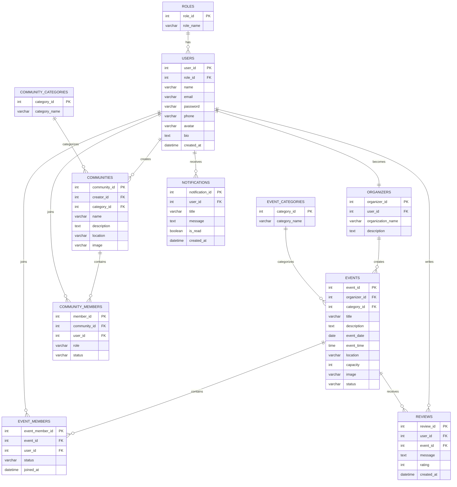

```mermaid
erDiagram

    ROLES {
        int role_id PK
        varchar role_name
    }

    USERS {
        int user_id PK
        int role_id FK
        varchar name
        varchar email
        varchar password
        varchar phone
        varchar avatar
        text bio
        datetime created_at
    }

    ORGANIZERS {
        int organizer_id PK
        int user_id FK
        varchar organization_name
        text description
    }

    EVENT_CATEGORIES {
        int category_id PK
        varchar category_name
    }

    EVENTS {
        int event_id PK
        int organizer_id FK
        int category_id FK
        varchar title
        text description
        date event_date
        time event_time
        varchar location
        int capacity
        varchar image
        varchar status
    }

    EVENT_MEMBERS {
        int event_member_id PK
        int event_id FK
        int user_id FK
        varchar status
        datetime joined_at
    }

    COMMUNITY_CATEGORIES {
        int category_id PK
        varchar category_name
    }

    COMMUNITIES {
        int community_id PK
        int creator_id FK
        int category_id FK
        varchar name
        text description
        varchar location
        varchar image
    }

    COMMUNITY_MEMBERS {
        int member_id PK
        int community_id FK
        int user_id FK
        varchar role
        varchar status
    }

    REVIEWS {
        int review_id PK
        int user_id FK
        int event_id FK
        text message
        int rating
        datetime created_at
    }

    NOTIFICATIONS {
        int notification_id PK
        int user_id FK
        varchar title
        text message
        boolean is_read
        datetime created_at
    }


    %% CARDINALITY / RELATIONSHIP

    ROLES ||--o{ USERS : has

    USERS ||--|| ORGANIZERS : becomes

    ORGANIZERS ||--o{ EVENTS : creates

    EVENT_CATEGORIES ||--o{ EVENTS : categorizes

    EVENTS ||--o{ EVENT_MEMBERS : contains

    USERS ||--o{ EVENT_MEMBERS : joins


    USERS ||--o{ COMMUNITIES : creates

    COMMUNITY_CATEGORIES ||--o{ COMMUNITIES : categorizes

    COMMUNITIES ||--o{ COMMUNITY_MEMBERS : contains

    USERS ||--o{ COMMUNITY_MEMBERS : joins


    USERS ||--o{ REVIEWS : writes

    EVENTS ||--o{ REVIEWS : receives


    USERS ||--o{ NOTIFICATIONS : receives

```
